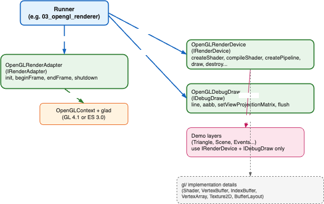
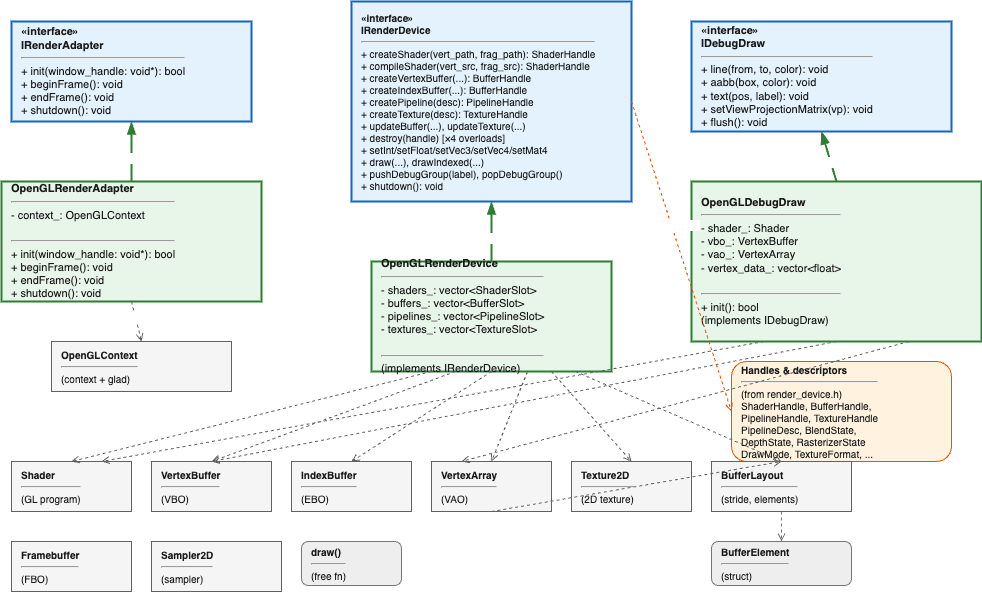

# OpenGL / OpenGL ES backend

**Figure 1: GL backend architecture** — Runner creates and owns the adapter, device, and debug draw; the adapter owns the OpenGL context (glad). Layers use only IRenderDevice and IDebugDraw. The device uses gl/ RAII primitives internally.

**Figure 2: GL backend class diagram** — Interfaces (IRenderAdapter, IRenderDevice, IDebugDraw) and their OpenGL implementations; handles and pipeline descriptors from render_device.h.

## Overview

The gl/ backend provides concrete implementations of **IRenderAdapter**, **IRenderDevice**, and **IDebugDraw** using raw OpenGL (via glad). It can be built in one of two modes:

| Build option | API | Use case |
|--------------|-----|----------|
| **VNE_TESTBED_OPENGL** | OpenGL 4.1 Core | Desktop (macOS, Windows, Linux). Highest core profile supported on macOS. |
| **VNE_TESTBED_OPENGLES** | OpenGL ES 3.0 | Mobile/embedded (iOS, Android, visionOS, Web). |

Exactly one of these options should be enabled per build; they are mutually exclusive. See [testbed.md](testbed.md#cmake-options) for the full CMake options table.

## Headers and types

All public types live in namespace `vne::testbed::gl`. Demo layers and runners include only the following headers; the backend-agnostic API is in `render_device.h` and `render_adapter.h`.

| Header | Types | Description |
|--------|--------|-------------|
| gl/opengl_render_adapter.h | OpenGLRenderAdapter | **IRenderAdapter**: init(window_handle), beginFrame(), endFrame(), shutdown(). Creates and owns the OpenGL context (glad). |
| gl/opengl_render_device.h | OpenGLRenderDevice | **IRenderDevice**: createShader (from file), compileShader (from source), createVertexBuffer, createIndexBuffer, createPipeline, createTexture; updateBuffer, updateTexture; destroy(handle); setInt/setFloat/setVec3/setVec4/setMat4; draw, drawIndexed; pushDebugGroup, popDebugGroup. Slot-based handle ids (0 = invalid). |
| gl/opengl_debug_draw.h | OpenGLDebugDraw | **IDebugDraw**: line(), aabb(), text() (no-op), flush(). Batched line rendering; call setViewProjectionMatrix() before flush(). |

The gl/ layer also contains RAII primitives used as implementation details (Shader, VertexBuffer, IndexBuffer, VertexArray, Texture2D, BufferLayout, etc.). Demo layers do not include these directly; they use only **IRenderDevice** and the handles/types from `render_device.h`.

## Context and lifecycle

### Runner responsibilities

1. **Context creation**  
   The runner must request a compatible GL context before calling the adapter:
   - **OpenGL 4.1**: `GLFW_CONTEXT_VERSION_MAJOR` 4, `GLFW_CONTEXT_VERSION_MINOR` 1, `GLFW_OPENGL_CORE_PROFILE`. On macOS also set `GLFW_OPENGL_FORWARD_COMPAT` to true.
   - **OpenGL ES 3.0**: `GLFW_CLIENT_API` = `GLFW_OPENGL_ES_API`, major 3, minor 0.

2. **Initialisation order**  
   After the window and context are current, call `OpenGLRenderAdapter::init(window_handle)` (e.g. with `GLFWwindow*`). Then construct **OpenGLRenderDevice** and **OpenGLDebugDraw** and call `OpenGLDebugDraw::init()` if using debug draw.

3. **Main loop**  
   Each frame: `renderer->beginFrame()`, layer rendering (including `device->draw*` and optional `debugDraw->line()/aabb()/flush()`), `renderer->endFrame()`. The runner performs buffer swap (e.g. glfwSwapBuffers).

4. **Shutdown**  
   Call `device->shutdown()` (or let the destructor run), then `renderer->shutdown()`, then destroy the window/context.

### Resource lifecycle

- **IRenderDevice** handles (shader, buffer, pipeline, texture) are created in layer `onAttach()` and destroyed in `onDetach()` via the same device instance.
- Pipeline destruction does not destroy the shader; destroy shaders explicitly when no longer needed.
- All device calls must happen on the thread that owns the GL context (no thread safety).

## Example

See **examples/03_opengl_renderer** for a full runner: GLFW window, OpenGL 4.1 or OpenGL ES 3.0 context (depending on build), OpenGLRenderAdapter, OpenGLRenderDevice, OpenGLDebugDraw, and layer stack with triangle/scene/events (and optional interaction) demo layers.

## Related documentation

- **Backend-agnostic API:** [render_device.h](../../../include/vertexnova/testbed/render_device.h) — IRenderDevice, handles, pipeline descriptors, draw API.
- **Testbed overview and CMake:** [testbed.md](testbed.md).
