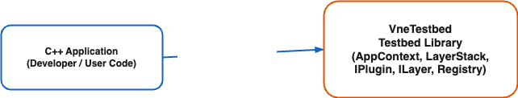
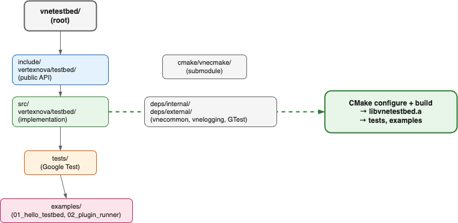
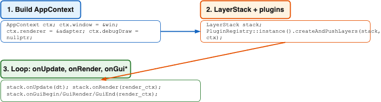

# VertexNova Testbed

## Overview

VneTestbed is a minimal C++ testbed for the VertexNova ecosystem. It provides a **layer-based** runtime: plugins register at static init and produce **layers**; a **LayerStack** owns layers and drives their lifecycle (onAttach, onUpdate, onRender, onGui*, onDetach). The runner supplies **AppContext** (window, renderer adapter, optional debug draw) and uses **PluginRegistry::createAndPushLayers** to populate the stack from all registered plugins. Use it as a starting point for tools, samples, or applications that need a standard layout (include, src, tests, samples), CMake setup with vnecmake, and optional internal deps (vnecommon, vnelogging, vnemath, vnescene).



**Figure 1: Context Diagram**

| Element | Description |
|---------|-------------|
| C++ Application | Developer/user code (runner, tests, or your app) that builds AppContext, creates a LayerStack, and drives the layer lifecycle. |
| VneTestbed | Testbed library: AppContext, LayerStack, ILayer, IPlugin, PluginRegistry, IRenderAdapter, IDebugDraw, RenderContext. |

## Project layout and build

The testbed follows a standard directory layout and builds a static library, tests, and optional samples:



**Figure 2: Project layout and build**

| Element | Description |
|---------|-------------|
| include/vertexnova/testbed/ | Public API headers: app_context.h, layer.h, layer_stack.h, plugin.h, plugin_registry.h, render_adapter.h, render_context.h, debug_draw.h, plugins/ |
| src/vertexnova/testbed/ | Implementation (layer.cpp, layer_stack.cpp, plugin_registry.cpp, plugins/scene_inspector_plugin.cpp) |
| tests/ | Unit tests (Google Test): smoke_test, layer_stack_test |
| samples/ | Sample apps (e.g. glfw_opengl/00_hello_testbed, 01_test_events) |
| cmake/vnecmake/ | CMake modules submodule |
| deps/internal/, deps/external/ | Internal (vnecommon, vnelogging, vnemath, vnescene, etc.) and external (googletest, glfw, glad) deps |
| CMake configure + build | Produces libvnetestbed.a, tests, and examples |

See the root [README.md](../../../README.md) for prerequisites, dependencies, and build commands.

## Core API

The public API lives in namespace `vne::testbed`. Main types:

| Header | Types | Description |
|--------|--------|-------------|
| app_context.h | AppContext, IWindow, IDebugDraw | Runner-filled context: window, renderer, optional debugDraw. IWindow: getWidth, getHeight, pollEvents, shouldClose. |
| render_adapter.h | IRenderAdapter | Pluggable render backend: init(window_handle), beginFrame(), endFrame(), shutdown(). |
| render_context.h | RenderContext, FrameInfo | Per-frame data passed to layers: frame_info (width, height, dt), debug_draw. |
| layer.h | ILayer | Layer lifecycle: onAttach(AppContext&), onDetach, onUpdate(dt), onBeginRender, onRender, onGuiBegin, onGuiRender, onGuiEnd, onEvent. State: setEnabled, setVisible, wantsInput, blocksInput. |
| layer_stack.h | LayerStack | Owns layers and overlays; pushLayer(layer, ctx), pushOverlay(overlay, ctx), popLayer, popOverlay, clear; onUpdate(dt), onBeginRender(ctx), onRender(ctx), onGuiBegin/Render/End(ctx), onEvent(event); getCount, getOverlayCount, findLayerByName, getAll. |
| plugin.h | IPlugin | Plugin interface: getName(), createLayers() → vector of ILayer. |
| plugin_registry.h | PluginRegistry, REGISTER_PLUGIN | Singleton registry; registerPlugin(unique_ptr<IPlugin>), createAndPushLayers(stack, ctx), getPluginCount(). REGISTER_PLUGIN(PluginClass) for static registration. |
| debug_draw.h | IDebugDraw, DebugAabb | Rich debug-draw API (line, aabb, text, flush) using vne::math::Vec3f; optional, see app_context.h for minimal draw() stub. |

## API usage



**Figure 3: Typical runner flow**

1. Create window (e.g. GLFW) and render adapter; build **AppContext** (window, renderer, optional debugDraw).
2. Create **LayerStack**; optionally push layers manually or call **PluginRegistry::instance().createAndPushLayers(stack, app_ctx)** to add layers from all registered plugins.
3. Main loop: each frame call stack.onUpdate(dt), renderer->beginFrame(), stack.onBeginRender(render_ctx), stack.onRender(render_ctx), stack.onGuiBegin/GuiRender/GuiEnd(render_ctx), renderer->endFrame(), window->pollEvents().
4. On exit: stack.clear(); renderer->shutdown(); destroy window.

Example (conceptually):

```cpp
#include "vertexnova/testbed/app_context.h"
#include "vertexnova/testbed/layer_stack.h"
#include "vertexnova/testbed/plugin_registry.h"
#include "vertexnova/testbed/render_context.h"

vne::testbed::AppContext app_ctx{};
app_ctx.window = &my_window;
app_ctx.renderer = &my_render_adapter;
app_ctx.debugDraw = nullptr;

vne::testbed::LayerStack stack;
vne::testbed::PluginRegistry::instance().createAndPushLayers(stack, app_ctx);

while (!app_ctx.window->shouldClose()) {
    float dt = 0.016f;
    stack.onUpdate(dt);
    app_ctx.renderer->beginFrame();
    vne::testbed::RenderContext render_ctx{};
    render_ctx.frame_info = { width, height, dt };
    stack.onBeginRender(render_ctx);
    stack.onRender(render_ctx);
    stack.onGuiBegin(render_ctx);
    stack.onGuiRender(render_ctx);
    stack.onGuiEnd(render_ctx);
    app_ctx.renderer->endFrame();
    app_ctx.window->pollEvents();
}

stack.clear();
```

See **examples/02_plugin_runner** for a full runner with GLFW and a stub render adapter. See **examples/03_opengl_renderer** for a full runner using the gl/ backend (OpenGL or OpenGL ES).

The gl/ backend (OpenGL 4.1 or OpenGL ES 3.0) is documented in a separate file: **[OpenGL / OpenGL ES backend](gl_backend.md)** — build options, headers (OpenGLRenderAdapter, OpenGLRenderDevice, OpenGLDebugDraw), context and lifecycle, and example reference.

## Plugins and layers

- **Plugins** (IPlugin) are registered at static init via **REGISTER_PLUGIN(PluginClass)** in a .cpp. They do not receive per-frame calls; they only provide **getName()** and **createLayers()**.
- **Layers** (ILayer) are the runtime unit: they receive **onAttach(AppContext&)** once so they can store window/renderer/debugDraw; if the layer is enabled at push time (the default), **onEnable()** is called immediately after. Then per-frame: **onUpdate**, **onBeginRender**, **onRender**, **onGuiBegin**/ **onGuiRender**/ **onGuiEnd**, and **onDetach** when removed (with **onDisable()** first if the layer was enabled).
- **PluginRegistry::createAndPushLayers(stack, ctx)** iterates all registered plugins, calls createLayers(), and pushLayer() for each non-null layer.

## CMake options

| Option | Default | Description |
|--------|---------|-------------|
| VNE_TESTBED_TESTS | ON (dev/CI) | Build unit tests. |
| VNE_TESTBED_SAMPLES | ON (dev) / OFF (submodule/CI) | Build sample programs (samples/). |
| VNE_TESTBED_CI | OFF | When ON, forces tests ON and samples OFF. |
| VNE_TESTBED_OPENGL | ON (if glad present) | Build the OpenGL 4.1 render adapter, debug draw, and demo layers. Mutually exclusive with VNE_TESTBED_OPENGLES. |
| VNE_TESTBED_OPENGLES | OFF | Build the OpenGL ES 3.0 backend (gl/ primitives and demo layers). Mutually exclusive with VNE_TESTBED_OPENGL. For ES builds the runner must request an OpenGL ES context (e.g. GLFW: `GLFW_CLIENT_API` = `GLFW_OPENGL_ES_API`, version 3.0). |
| WARNINGS_AS_ERRORS | OFF | Treat compiler warnings as errors. |
| ENABLE_DOXYGEN | OFF | Generate Doxygen documentation. |

## Documentation

- **This document:** `docs/vertexnova/testbed/testbed.md`
- **OpenGL / OpenGL ES backend:** [gl_backend.md](gl_backend.md) — gl/ backend: build options, headers, context and lifecycle, examples.
- **Design (plugin system):** `docs/vertexnova/testbed/plugin_system_design.md` — design ideas; current code uses the layer-based API above.
- **Diagrams:** `docs/vertexnova/testbed/diagrams/` (Draw.io sources; export to PNG as described in [diagrams/README.md](diagrams/README.md))
- **API reference:** Generated by Doxygen when `-DENABLE_DOXYGEN=ON` (see root README)
