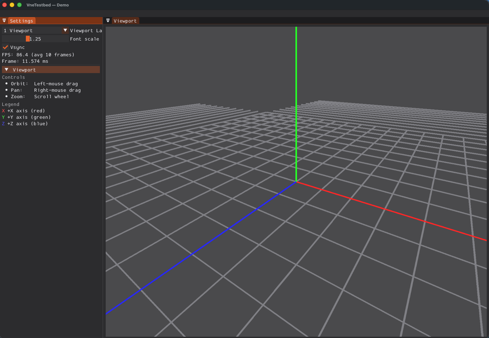
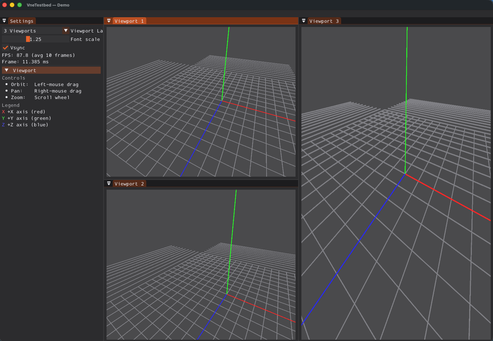
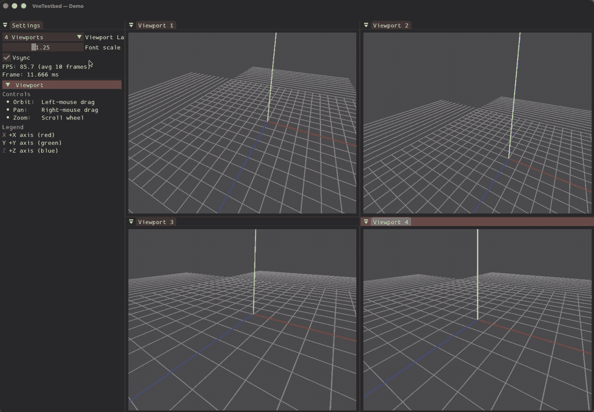

# 00 - Hello Testbed

The baseline demo that every subsequent GLFW/OpenGL sample is built on. Proves the FBO → ImGui viewport pipeline and the Settings panel.

## What This Sample Shows

1. **FBO viewport**: Scene is rendered to a framebuffer that fills the ImGui "Viewport" window correctly.
2. **Viewport resize**: Resizing the viewport keeps the image filling the panel (no stretching).
3. **VSync**: Toggle in the application responds immediately.
4. **Grid and axes**: Spatial reference and confirmation that the camera and scene work.
5. **Orbit-arcball** (when `vne::interaction` is enabled): LMB drag rotates, RMB drag pans, scroll zooms.
6. **ImGui Settings**: Demo-specific section **Viewport** with controls reference and axis legend.

## Screenshots and Demo

### Single viewport (grid + axes, controls visible)


*Figure 1: Single viewport rendering (grid + axes) with the controls/settings panel visible.*

### Multi viewport (3 panes)


*Figure 2: Docked multi-viewport layout (3 panes). Each viewport can be manipulated independently.*

### Video (4 viewports, interactions)



This GIF shows how to interact with the demo when **multiple viewports** are docked:
Note: The GIF is frame-skipped and also sped up so it can include the full recording timeline within a smaller file. 
- rotate / pan / zoom in different viewports (each viewport has its own camera),
- **VSync** unchecked to make FPS visible,
- dragging/docking the viewport panel to a different place.

## Try it (quick checklist)

1. Run `00_hello_testbed`.
2. Under **Settings → Viewport**:
   - uncheck **VSync**,
   - enable **multi-viewport layout** (2 or 4 panes).
3. Use mouse:
   - **LMB** drag: rotate (orbit-arcball),
   - **RMB** drag: pan,
   - **Scroll wheel**: zoom.

## Building

**Preferred: use the project scripts** (they pick a compiler, build layout, and optional presets). See [`scripts/README.md`](../../../scripts/README.md) for full options.

```bash
# macOS
./scripts/build_macos.sh -t Debug -a configure_and_build

# Linux
./scripts/build_linux.sh -t Debug -a configure_and_build

# Windows (Git Bash / WSL)
./scripts/build_windows.sh -t Debug -a configure_and_build

# Windows (Visual Studio Developer Command Prompt — recommended on Windows)
python scripts/build_windows.py -t Debug -a configure_and_build
```

Scripts place outputs under directories such as `build/<BuildType>/build-macos-clang-*` or `build/<BuildType>/build-linux-*`. Enable samples with CMake if your configure step does not already turn them on, for example `-DVNE_TESTBED_SAMPLES=ON` or `-DVNE_TESTBED_DEV=ON` (samples + tests).

**Manual CMake** (from the vnetestbed repository root) works the same way without the scripts:

```bash
cmake -B build -DVNE_TESTBED_SAMPLES=ON
cmake --build build
```

Or a dev tree (samples + tests):

```bash
cmake -B build -DVNE_TESTBED_DEV=ON
cmake --build build
```

### Using an IDE

You can open the **same CMake project** in an IDE and build or debug the sample targets there:

- **Qt Creator**: File → Open Project → choose the top-level `CMakeLists.txt`, configure kit, then build the `00_hello_testbed` target.
- **Visual Studio**: Open Folder on the repo root (CMake integration) or generate a solution with CMake and open it; run **`00_hello_testbed`** under `bin/samples`.
- **Xcode**: From macOS, `./scripts/build_macos.sh -xcode` (see `scripts/README.md`) generates an Xcode project beside the usual build, or use CMake’s Xcode generator and open the generated project.

Point the IDE’s run configuration at the **`00_hello_testbed`** executable under your build tree’s `bin/samples` directory.

## Running

```bash
# After a plain cmake -B build
./build/bin/samples/00_hello_testbed
```

When you built with a script, run the executable under that script’s build directory, for example:

```bash
./build/Debug/build-macos-clang-*/bin/samples/00_hello_testbed
```

Exit with **ESC** or by closing the window.

## Key Concepts

- **BaseSceneLayer**: Renders grid, axes, and a perspective camera; shared with other samples via `samples/glfw_opengl/common/base_scene_layer.h`.
- **BaseInteractionLayer**: Orbit-arcball manipulator (optional); LMB orbit, RMB pan, scroll zoom.
- **ImGui viewport**: The scene is drawn into an ImGui window; multi-viewport layouts (2 or 4 panes) are supported when ImGui docking is enabled.
- **Libraries**: vne::testbed, vne::scene, vne::interaction (optional).

## Code Structure

- `demo_hello_testbed.cpp`: Registers the demo with `VNETESTBED_REGISTER_DEMO("hello_testbed", ...)` and pushes `BaseSceneLayer`, optional `BaseInteractionLayer`, and `HelloSettingsLayer` (Viewport panel).
- `../common/base_scene_layer.h`: Shared scene and interaction layer base used by 00, 01, 02, 03.
