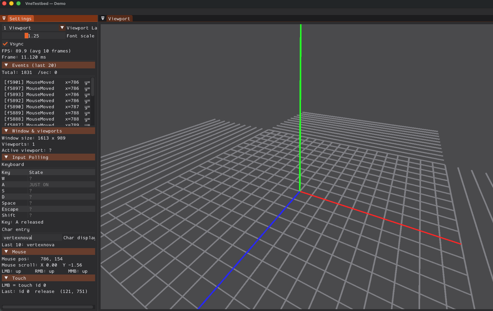

# 01 - Test Events

Builds on **00_hello_testbed** (grid, axes, optional orbit camera) and adds a live **Settings** sidebar: rolling event log, window/viewport info, and **Input Polling** (keyboard, mouse, char entry, touch). Use this sample to verify vneevents delivery and to compare **discrete events** with **polled input state**.

## What This Sample Shows

1. **Event delivery**: `onEvent()` receives keyboard (press / repeat / release), committed text (`TextInputEvent`), mouse buttons, move, scroll, window resize and close, and touch (press / move / release) with type-appropriate data.
2. **Event log**: Last N lines (newest first), each prefixed with the frame index when the event was logged; header shows **Total** event count and **events per second** (rolling 1-second rate).
3. **Touch emulation**: Left mouse is synthesized as touch id `0` (`TouchPress` / `TouchMove` / `TouchRelease`). Enabled only in this demo via `GlfwWindow::setTouchEmulationEnabled(true)` so other samples do not get duplicate mouse + touch.
4. **Window & viewports**: Window size, ImGui viewport count, and which viewport is under the mouse (when ImGui viewports are available).
5. **Input polling**: `InputManager` shows live WASD, Space, Escape, Shift held/edge state; mouse position, scroll, button up/down; last `TextInputEvent` commit; ImGui char-entry buffer; last touch summary under **Touch** (LMB = touch id 0).

## Screenshots and Demo

### Settings: Events, window/viewports, and input polling


*Figure 1: Settings sidebar with event log (total + /sec), window/viewport info, and Input Polling (keyboard, char entry, mouse, touch).*

## Try it (quick checklist)

1. Run `01_test_events`.
2. Open **Settings** and expand **Events (last …)** — press keys, move the mouse, scroll, resize the window; watch the log and **Total** / **/sec** counters.
3. Expand **Window & viewports** — resize the window and move the mouse across viewports (if using a multi-viewport layout like in 00).
4. Under **Input Polling**, try **Keyboard** (WASD, Space, Escape, Shift), **Text input** / **ImGui char field**, **Mouse**, and **Touch** (with touch emulation: drag with **LMB** to generate touch move/release).
5. Exit with **ESC** or by closing the window.

## Building

**Preferred: use the project scripts** (they pick a compiler, build layout, and optional presets). See [`scripts/README.md`](../../../scripts/README.md) for full options.

```bash
# macOS
./scripts/build_macos.sh -t Debug -a configure_and_build

# Linux
./scripts/build_linux.sh -t Debug -a configure_and_build

# Windows (Git Bash / WSL)
./scripts/build_windows.sh -t Debug -a configure_and_build

# Windows (Visual Studio Developer Command Prompt — recommended on Windows)
python scripts/build_windows.py -t Debug -a configure_and_build
```

Scripts place outputs under directories such as `build/<BuildType>/build-macos-clang-*` or `build/<BuildType>/build-linux-*`. Enable samples with CMake if your configure step does not already turn them on, for example `-DVNE_TESTBED_SAMPLES=ON` or `-DVNE_TESTBED_DEV=ON` (samples + tests).

**Manual CMake** (from the vnetestbed repository root) works the same way without the scripts:

```bash
cmake -B build -DVNE_TESTBED_SAMPLES=ON
cmake --build build
```

Or a dev tree (samples + tests):

```bash
cmake -B build -DVNE_TESTBED_DEV=ON
cmake --build build
```

### Using an IDE

You can open the **same CMake project** in an IDE and build or debug the sample targets there:

- **Qt Creator**: File → Open Project → choose the top-level `CMakeLists.txt`, configure kit, then build the `01_test_events` target.
- **Visual Studio**: Open Folder on the repo root (CMake integration) or generate a solution with CMake and open it; run **`01_test_events`** under `bin/samples`.
- **Xcode**: From macOS, `./scripts/build_macos.sh -xcode` (see `scripts/README.md`) generates an Xcode project beside the usual build, or use CMake’s Xcode generator and open the generated project.

Point the IDE’s run configuration at the **`01_test_events`** executable under your build tree’s `bin/samples` directory.

## Running

```bash
# After a plain cmake -B build
./build/bin/samples/01_test_events
```

When you built with a script, run the executable under that script’s build directory, for example:

```bash
./build/Debug/build-macos-clang-*/bin/samples/01_test_events
```

Interact with the window (keys, mouse, scroll, resize) and watch **Settings**. Exit with **ESC** or by closing the window.

## Key Concepts

- **EventsLayer**: Implements `onEvent()` and maintains the deque log, totals, and events-per-second (updated in `onUpdate()` from per-frame event counts).
- **EventsSettingsLayer**: ImGui **Settings** content — **Events (last N)**, **Window & viewports**, **Input Polling** (nested **Mouse** and **Touch**).
- **Touch emulation**: Opt-in per window via `GlfwWindow::setTouchEmulationEnabled(true)`; only this sample enables it at registration time.
- **Input polling**: Uses `vne::events::InputManager` (`isKeyPressed`, `mousePosition`, etc.) alongside the event stream.
- **Libraries**: vne::testbed, vne::scene, vne::events, vne::interaction (optional).

## Code Structure

- `demo_test_events.cpp`: Registers the demo with `VNETESTBED_REGISTER_DEMO("test_events", ...)`, enables touch emulation on the GLFW window, then pushes `BaseSceneLayer`, optional `BaseInteractionLayer`, `EventsLayer`, and `EventsSettingsLayer`.
- `../common/base_scene_layer.h`: Shared scene and interaction layer base used with other GLFW/OpenGL samples.
