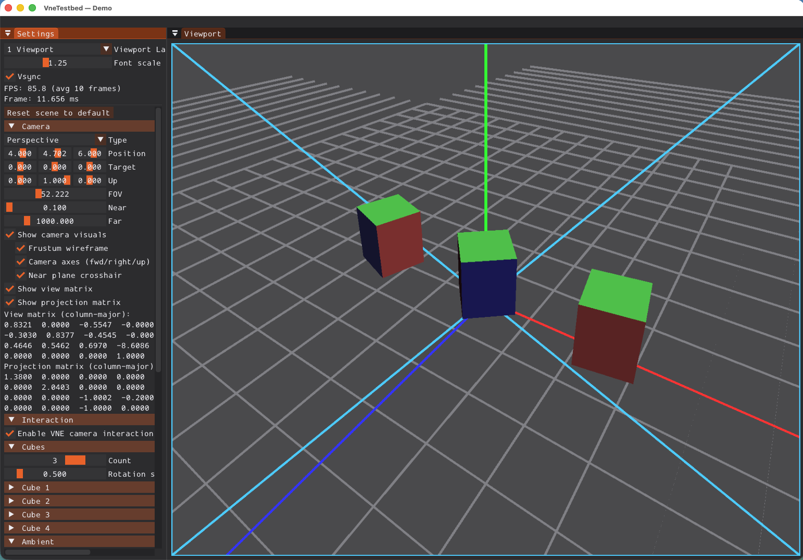
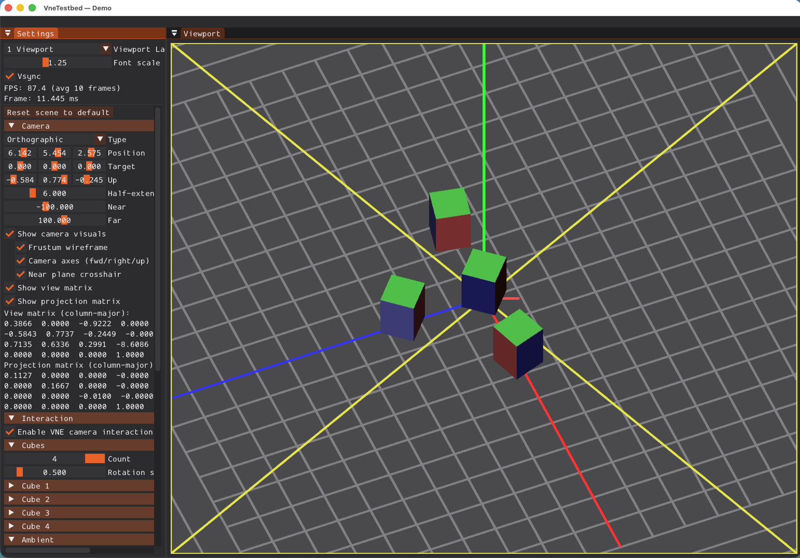

# 02 - Test Scene

Full **Scene** demo: perspective/ortho camera, rotating cubes, and configurable lighting (ambient, directional, spot, point lights). Lit geometry uses the shared testbed **`MeshRenderer`** and embedded **Blinn-Phong** shaders (same path as `03_test_interaction`’s `MeshLayer`), not per-sample GLSL files.

This sample follows the same **build / run / IDE** workflow as [`00_hello_testbed`](../00_hello_testbed/README.md) and [`01_test_events`](../01_test_events/README.md). It does **not** include the **01** `EventsLayer` event log; it focuses on scene rendering and ImGui scene controls.

## What This Sample Shows

1. **Camera**: Switch at runtime between `PerspectiveCamera` and `OrthographicCamera`; FOV, near/far (perspective) or half-extent (ortho); position, target, up. Optional debug visuals (position cross, target cross, up vector, view direction, frustum).
2. **Cubes**: 3–4 rotating cubes drawn via `MeshRenderer::drawMesh` with indexed `IRenderDevice` buffers; per-cube model matrix display in the Settings panel.
3. **Lighting**: Ambient and directional lights; one spot light (position, direction, inner/outer angles, range); up to 4 point lights (add/remove, orbit radius/speed). Optional attenuation formula (constant + linear×d + quadratic×d²) for point/spot.
4. **Mesh rendering**: Shaders come from **testbed** `PhongMaterial` (desktop OpenGL and OpenGL ES sources embedded in the library). The sample only supplies vertex/index buffers for the procedural cube.
5. **Interaction** (when `vne::interaction` is enabled): Toggle VNE camera interaction (orbit/pan/zoom) on or off; reset scene to default (camera, cubes, lights, options).

## Screenshots and Demo

### Perspective camera


*Figure 1: **Perspective** camera (FOV / near / far); lit cubes on grid with axes; **Settings** (camera, matrices, cubes) on the left, **Viewport** on the right.*

### Orthographic camera


*Figure 2: **Orthographic** camera (half-extent / near / far); same layout—parallel projection with frustum and camera debug visuals.*

## Try it (quick checklist)

1. Run `02_test_scene`.
2. Under **Settings → Viewport** (same as other samples): adjust **Vsync** and **Viewport Layout** if you use multi-viewport docking.
3. Use the **Camera**, **Interaction**, **Cubes**, **Ambient**, **Directional Light**, **Point Lights**, **Spot Light**, and **Attenuation** sections to change the scene.
4. Exit with **ESC** or by closing the window.

## Building

**Preferred: use the project scripts** (they pick a compiler, build layout, and optional presets). See [`scripts/README.md`](../../../scripts/README.md) for full options.

```bash
# macOS
./scripts/build_macos.sh -t Debug -a configure_and_build

# Linux
./scripts/build_linux.sh -t Debug -a configure_and_build

# Windows (Git Bash / WSL)
./scripts/build_windows.sh -t Debug -a configure_and_build

# Windows (Visual Studio Developer Command Prompt — recommended on Windows)
python scripts/build_windows.py -t Debug -a configure_and_build
```

Scripts place outputs under directories such as `build/<BuildType>/build-macos-clang-*` or `build/<BuildType>/build-linux-*`. Enable samples with CMake if your configure step does not already turn them on, for example `-DVNE_TESTBED_SAMPLES=ON` or `-DVNE_TESTBED_DEV=ON` (samples + tests).

**Manual CMake** (from the vnetestbed repository root) works the same way without the scripts:

```bash
cmake -B build -DVNE_TESTBED_SAMPLES=ON
cmake --build build
```

Or a dev tree (samples + tests):

```bash
cmake -B build -DVNE_TESTBED_DEV=ON
cmake --build build
```

### Using an IDE

You can open the **same CMake project** in an IDE and build or debug the sample targets there:

- **Qt Creator**: File → Open Project → choose the top-level `CMakeLists.txt`, configure kit, then build the `02_test_scene` target.
- **Visual Studio**: Open Folder on the repo root (CMake integration) or generate a solution with CMake and open it; run **`02_test_scene`** under `bin/samples`.
- **Xcode**: From macOS, `./scripts/build_macos.sh -xcode` (see `scripts/README.md`) generates an Xcode project beside the usual build, or use CMake’s Xcode generator and open the generated project.

Point the IDE’s run configuration at the **`02_test_scene`** executable under your build tree’s `bin/samples` directory.

## Running

```bash
# After a plain cmake -B build
./build/bin/samples/02_test_scene
```

When you built with a script, run the executable under that script’s build directory, for example:

```bash
./build/Debug/build-macos-clang-*/bin/samples/02_test_scene
```

Use the Settings panel to change camera, cubes, and lights; enable the spot light and point lights to see their effect. Exit with **ESC** or by closing the window.

## Key Concepts

- **PerspectiveCamera / OrthographicCamera**: vnescene cameras with view and projection matrices; aspect ratio updated on viewport resize.
- **SceneTestLayer**: Owns cameras, procedural cube geometry, lights, and debug drawing; builds `PhongLightParams` and draws each cube with `MeshRenderer::drawMesh`.
- **MeshRenderer / PhongMaterial**: Shared Blinn-Phong path (embedded GLSL); same idea as [`MeshLayer`](../../../include/vertexnova/testbed/utils/mesh_layer.h) in `03_test_interaction`.
- **Spot light angles**: Inner/outer angles are clamped so outer > inner + ε (CPU-side) to keep the spot falloff denominator non-zero.
- **Libraries**: vne::testbed, vne::scene, vne::events, vne::interaction (optional).

## Code Structure

- `demo_test_scene.h` / `demo_test_scene.cpp`: `SceneTestLayer`, `SceneSettingsLayer`, and `registerTestSceneDemo` (`VNETESTBED_REGISTER_DEMO("test_scene", ...)`); optional `BaseInteractionLayer`; ImGui panels for camera, interaction, cubes, and lights.
- `../common/base_scene_layer.h`: Shared scene and interaction layer base used by other GLFW/OpenGL samples.
